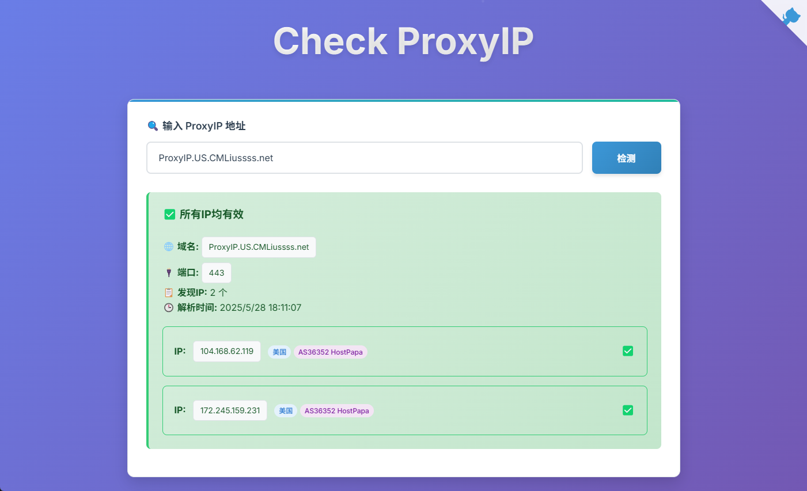

# 🌐 ProxyIP

> 基于 Cloudflare Workers 的高性能 ProxyIP 验证服务

[](https://workers.cloudflare.com/)
[](LICENSE)
[](https://github.com/cmliu/CF-Workers-CheckProxyIP)

## 📖 项目简介

ProxyIP 是一个部署在 Cloudflare Workers 上的轻量级 ProxyIP 验证工具。它能够快速、准确地检测代理IP的可用性，帮助用户筛选出有效的代理服务器。

### ✨ 主要特性

- 🚀 **高性能**：基于 Cloudflare Workers 边缘计算，全球低延迟
- 🔍 **智能检测**：自动识别IPv4/IPv6地址和域名
- 🌍 **全球部署**：利用 Cloudflare 全球网络，就近检测
- 📱 **响应式界面**：支持桌面和移动设备访问
- ⚡ **实时结果**：秒级响应，即时获取检测结果
- 🔒 **安全可靠**：无需存储用户数据，保护隐私安全

## 🤔 什么是 ProxyIP ？

### 📖 ProxyIP 概念

在 Cloudflare Workers 环境中，ProxyIP 特指那些能够成功代理连接到 Cloudflare 服务的第三方 IP 地址。

### 🔧 技术原理

根据 Cloudflare Workers 的 [TCP Sockets 官方文档](https://developers.cloudflare.com/workers/runtime-apis/tcp-sockets/) 说明，存在以下技术限制：

> ⚠️ **重要限制**  
> Outbound TCP sockets to [Cloudflare IP ranges](https://www.cloudflare.com/ips/) are temporarily blocked, but will be re-enabled shortly.

这意味着 Cloudflare Workers 无法直接连接到 Cloudflare 自有的 IP 地址段。为了解决这个限制，需要借助第三方云服务商的服务器作为"跳板"：

```
Cloudflare Workers → ProxyIP 服务器 → Cloudflare 服务
    (发起请求)      (第三方代理)      (目标服务)
```

通过第三方服务器反向代理 Cloudflare 的 443 端口，实现 Workers 对 Cloudflare 服务的访问。

### 🎯 实际应用场景

> **由于上述限制**，[**edgetunnel**](https://github.com/cmliu/edgetunnel)、[**epeius**](https://github.com/cmliu/epeius) 等项目，在尝试访问使用 Cloudflare CDN 服务的网站时，会因为无法建立到 Cloudflare IP 段的连接而导致访问失败。
> 
> **解决方案：** 通过配置有效的 ProxyIP，这些项目可以绕过限制，成功访问托管在 Cloudflare 上的目标网站，确保服务的正常运行。

### ✅ 有效 ProxyIP特征

一个有效的 ProxyIP 必须具备以下特征：

- **网络连通性：** 能够成功建立到指定端口（通常为 443）的 TCP 连接
- **代理功能：** 具备反向代理 Cloudflare IP 段的 HTTPS 服务能力

> 💡 **提示：** 本检测服务通过模拟真实的网络连接来验证 ProxyIP 的可用性，帮助您快速识别和筛选出稳定可靠的代理服务器。

## 🚀 部署方式

- **Workers** 部署：复制 [_worker.js](https://github.com/89112317/ProxyIP/blob/main/_worker.js) 代码，保存并部署即可
- **Pages** 部署：`Fork` 后 `连接GitHub` 一键部署即可

## 📝 使用方法

### 网页界面

直接访问你的 Worker 地址，使用友好的网页界面进行检测：

```
https://iptest.891123.xyz
```

### API 接口

#### 🔗 检查单个 ProxyIP
- `proxyip` 参数支持 IPv4、IPv6 地址和域名，端口号可选，不填默认为 443。
```bash
# 检查带端口的 IP
curl "https://iptest.891123.xyz/check?proxyip=1.2.3.4:443"

# 检查不带端口的 IP（默认使用443端口）
curl "https://iptest.891123.xyz/check?proxyip=1.2.3.4"

# 检查 IPv6 地址
curl "https://iptest.891123.xyz/check?proxyip=[2001:db8::1]:443"

# 检查域名
curl "https://iptest.891123.xyz/check?proxyip=example.com:443"
```

- 设置 `TOKEN` 变量后，需要在路径中添加 `token=your-secret-token` 才能使用接口。

```bash
curl "https://iptest.891123.xyz/check?proxyip=1.2.3.4:443&token=your-secret-token"
```

#### 📄 响应格式

```json
{
  "success": true,
  "proxyIP": "1.2.3.4",
  "portRemote": 443,
  "colo": "HKG",
  "responseTime": "1320ms",
  "message": "第3次验证有效ProxyIP",
  "timestamp": "2025-06-03T17:21:25.045Z"
}
```

#### 🔧 参数说明

| 参数 | 类型 | 必填 | 说明 |
|------|------|------|------|
| `proxyip` | string | ✅ | 要检测的代理IP地址，支持IPv4、IPv6和域名 |
| `token` | string | ❌ | 设置 `TOKEN` 变量后，需要在路径中添加 `token=your-secret-token` 才能使用接口。 |

#### 📊 响应字段

| 字段 | 类型 | 说明 |
|------|------|------|
| `success` | boolean | 代理IP是否可用 |
| `proxyIP` | string | 检测的IP地址（失败时为 -1） |
| `portRemote` | number | 使用的端口号（失败时为 -1） |
| `colo` | string | 执行此次请求的Cloudflare机房代码 |
| `responseTime` | string | 响应时间（成功时为毫秒，失败时为 -1） |
| `message` | string | 检测结果说明信息 |
| `timestamp` | string | 检测时间戳 |

## 🔧 环境变量配置

| 变量名 | 说明 | 示例 | 必需 |
|--------|------|------|------|
| `TOKEN` | API 访问令牌，用于保护接口（设置`TOKEN`之后，首页会变成**nginx**，避免变成公共服务） | `your-secret-token` | 否 |
| `URL302` | 302跳转伪装首页 | `https://example.com` | 否 |
| `URL` | 反向代理伪装首页 | `https://example.com` | 否 |
| `ICO` | 网站图标 URL | `https://example.com/favicon.ico` | 否 |

## 📄 许可证

本项目采用 MIT 许可证 - 查看 [LICENSE](LICENSE) 文件了解详情

## 🙏 致谢
- [@houyiTFG](https://t.me/houyiTFG) - 天书作者
- [Cloudflare Workers](https://workers.cloudflare.com/) - 提供强大的边缘计算平台
- 所有贡献者和使用者的支持
